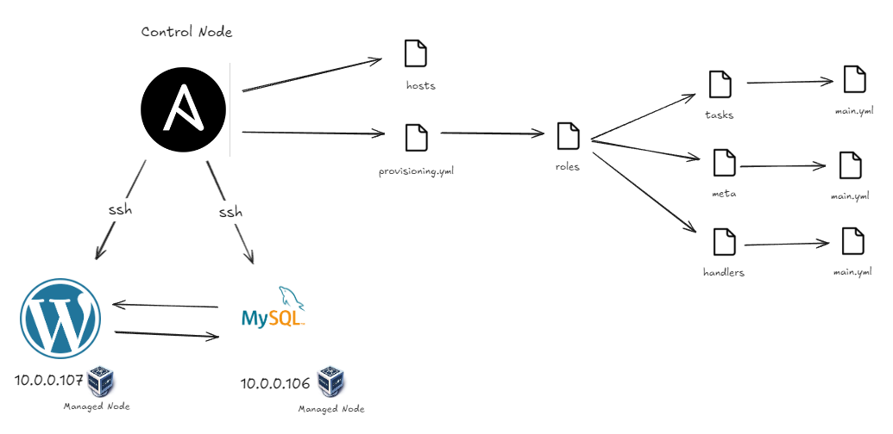
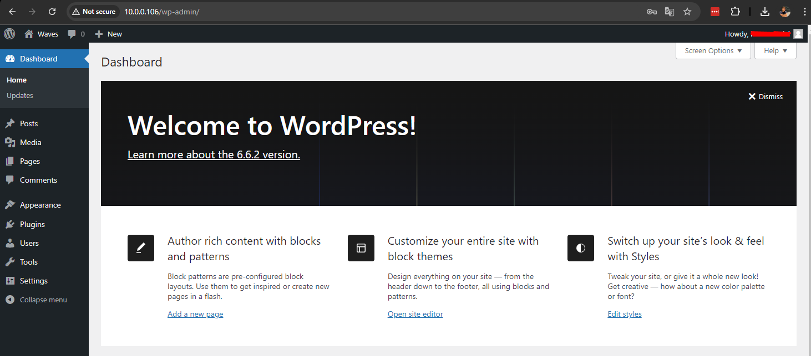

# Subindo Aplicação WordPress com Ansible
Este projeto visa automatizar a instalação do WordPress com um banco de dados MySQL utilizando Ansible. A seguir estão as instruções para configurar e executar o ambiente.

<div align="center">
    
</div>

## Pré-requisitos
- **Control Node:** Máquina Linux com python3 instalado.
- **Managed Nodes:** Dois servidores, um para o WordPress e outro para o MySQL.
- **Chave SSH:** Configuração de chaves SSH para acesso aos Managed Nodes.

***P.S:** Usei o Ubuntu 24.04 TLS.*

## Passos para Instalação
### 1. Clone esse repositório dentro do seu Control Node 
No seu Control Node, execute:
``` bash
git clone https://github.com/lorenzouriel/ansible-wordpress-mysql.git

cd ansible-wordpress-mysql
```

### 2. Suba os Managed Nodes
Levante dois servidores para servir como Managed Nodes. Em cada um, instale o `openssh-server` e obtenha o endereço IP:
``` bash
ip addr
```

### 3. Configure o Arquivo de Hosts
Edite o arquivo `hosts` com os IPs dos Managed Nodes, substituindo os valores conforme necessário:
``` bash
[wordpress]
10.0.0.106 ansible_user=user ansible_ssh_private_key_file='/home/user/ansible/delta1'

[mysql]
10.0.0.107 ansible_user=user ansible_ssh_private_key_file='/home/user/ansible/deltadb'
```

### 4. Gere as Chaves SSH
No Control Node, gere chaves SSH para ambos os Managed Nodes (WordPress e MySQL):
``` bash
ssh-keygen # deltadb e delta1
```

### 5. Adicione a Chave SSH nos Managed Nodes
Adicione a chave pública em cada Managed Node:
``` bash
ssh-copy-id -i delta1.pub usuario@10.0.0.106 # wordpress

ssh-copy-id -i deltadb.pub usuario@10.0.0.107 # mysql
```

### 6. Execute o Playbook
Agora, execute o playbook `provisioning.yml` para provisionar os servidores:
``` bash
ansible-playbook provisioning.yml -i hosts -K
```
O parâmetro `-K` solicita sua senha para usar o `sudo` nos Managed Nodes.

### 7. Acesse o WordPress
Após a execução bem-sucedida, você poderá acessar o WordPress no navegador através do IP do Managed Node que está rodando o WordPress.

<div align="center">
    
</div>

> .

> ENGLISH HERE 

> .

# Up WordPress Application with Ansible
This project aims to automate the installation of WordPress with a MySQL database using Ansible. The following are instructions for configuring and running the environment.

<div align="center">
    
</div>

## Prerequisites
- **Control Node:** Linux machine with Python 3 installed.
- **Managed Nodes:** Two servers, one for WordPress and one for MySQL.
- **SSH Key:** Configuration of SSH keys for access to Managed Nodes.

***P.S:** I used Ubuntu 24.04 TLS.*

## Installation Steps
### 1. Clone this repository within your Control Node 
On your Control Node, run:
``` bash
git clone https://github.com/lorenzouriel/ansible-wordpress-mysql.git

cd ansible-wordpress-mysql
```

### 2. Upload Managed Nodes
Raise two servers to serve as Managed Nodes. On each one, install `openssh-server` and get the IP address:
``` bash
ip addr
```

### 3. Configure the Hosts File
Edit the `hosts` file with the Managed Node IPs, replacing the values ​​as necessary:
``` bash
[wordpress]
10.0.0.106 ansible_user=user ansible_ssh_private_key_file='/home/user/ansible/delta1'

[mysql]
10.0.0.107 ansible_user=user ansible_ssh_private_key_file='/home/user/ansible/deltadb'
```

### 4. Generate SSH Keys
On the Control Node, generate SSH keys for both Managed Nodes (WordPress and MySQL):
``` bash
ssh-keygen # deltadb and delta1
```

### 5. Add the SSH Key to the Managed Nodes
Add the public key to each Managed Node:
``` bash
ssh-copy-id -i delta1.pub user@10.0.0.106 # wordpress

ssh-copy-id -i deltadb.pub user@10.0.0.107 # mysql
```

### 6. Run the Playbook
Now run the `provisioning.yml` playbook to provision the servers:
``` bash
ansible-playbook provisioning.yml -i hosts -K
```
The `-K` parameter requests your password to use `sudo` on Managed Nodes.

### 7. Access WordPress
After successful execution, you will be able to access WordPress in the browser through the IP of the Managed Node that is running WordPress.

<div align="center">
    
</div>